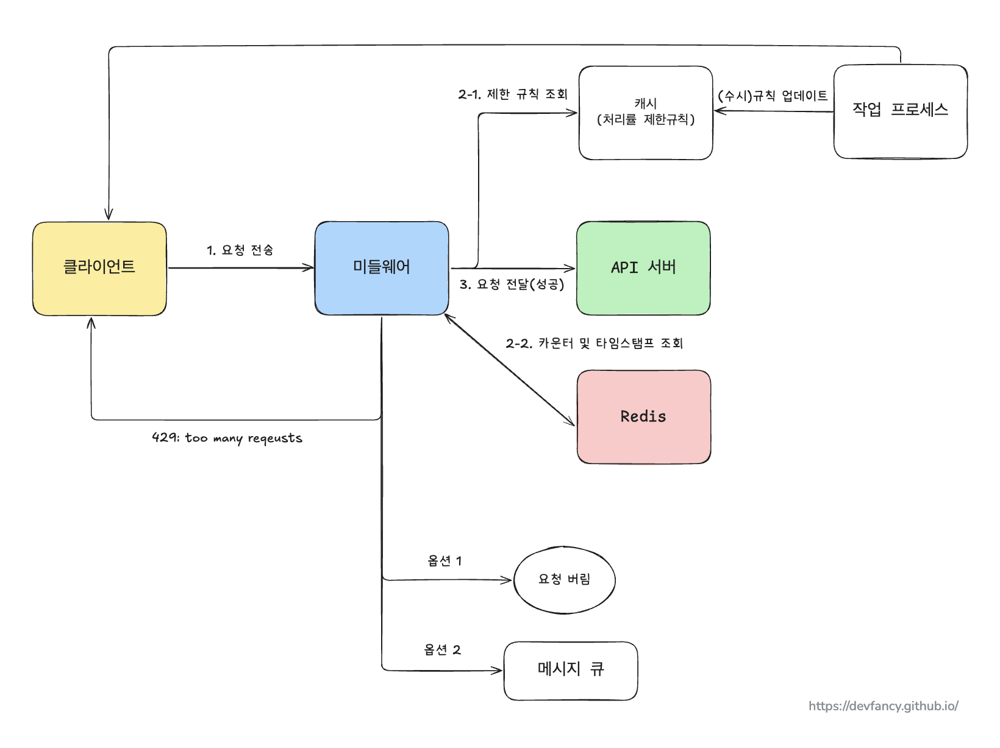
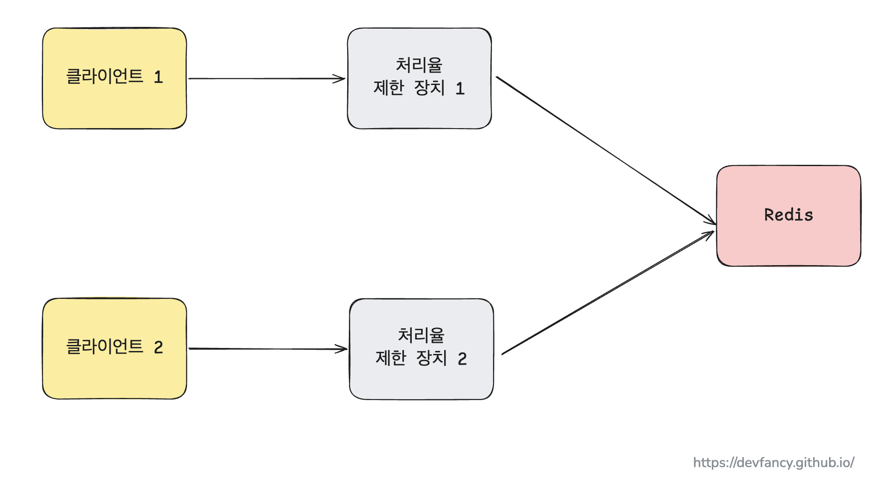

# 4장. 처리율 제한 장치의 설계

> 이 글은 [가상 면접 사례로 배우는 대규모 설계 기초](https://product.kyobobook.co.kr/detail/S000001033116) 책 내용을 기반으로 작성했습니다.

`처리율 제한 장치`(rate limiter)란 클라이언트 또는 서비스가 보내는 트래픽의 처리율을 제어하기 위한 장치이다.

HTTP로 예를 들면 특정 기간 내에 전송되는 클라이언트의 요청 횟수를 제한한다.

API에 처리율 제한 장치를 두면 좋은 점은 아래와 같다.

- Dos 공격에 의한 자원 고갈을 방지할 수 있다. -> 대형 IT 기업들이 공개한 거의 대부분의 API는 어떤 형태로든 처리율 제한 장치를 갖고 있다.
    - 트위터: 3시간 동안 300개의 트윗만 올릴 수 있도록 제한
    - 구글 독스: 분당 300회의 read 요청만 허용
- 비용을 절감한다. -> 추가 요청에 대한 처리를 제한하면 서버 대수를 조절할 수 있고, 우선순위가 높은 API에 더 많은 자원을 할당할 수 있다.
- 서버 과부화를 막는다.

## 개락적 설계안

처리율 제한 장치는 클라이언트 or 서버에 둘 수 있다.

- 클라이언트에 둔다면 -> 위변조가 가능해서 안정적으로 걸 수 없고, 모든 클라이언트의 구현을 통제하기도 어렵다.
- 서버에 둔다면 -> `API 서버`에 둘 수도 있고, API 서버에 요청을 보내기 전에 `미들웨어`에 둘 수도 있다.
    - 만약 제한된 요청 범위를 초과한다면 HTTP 상태코드 429가 반환한다. (429 - 사용자가 너무 낳은 요청을 보내고 있음을 의미한다.)
    - 마이크로서비스의 경우에는 보통 `API 게이트웨이`(미들웨어)에 처리율 제한 장치를 둔다.

결론적으로 처리율 제한 장치를 어디에 두는지에 대해서는 정답은 없다. -> 기술 스택, 인력, 우선순위, 목표에 따라 달라질 수 있기 때문

### 처리율 제한 알고리즘

널리 알려진 알고리즘은 아래와 같다.

- 토큰 버킷 (token bucket)
- 누출 버킷 (leaky bucket)
- 고정 윈도 카운터 (fixed window counter)
- 이동 윈도 로그 (sliding window log)
- 이동 윈도 카운터 (sliding window counter)

(이 중에서 토큰 버킷에 대한 알고리즘만 정리하고, 나머지는 필요에 따라 책을 참고하자.)

### 토큰 버킷 알고리즘

동작원리: 토큰 버킷 -> 지정된 용량을 가진 컨테이너다. 버킷에는 사전에 설정된 양의 토큰이 주기적으로 채워진다.

- 각 요청이 처리될 때마다 하나의 토큰이 사용된다. -> 요청이 도착하면 버킷에 토큰이 남아있는지 확인한다.
- 만약 요청이 도착했을 때 충분한 토큰이 남아있지 않을 경우 -> 해당 토큰은 버려지게 된다.

토큰 버킷 알고리즘은 2개의 인자를 받는다.

- 버킷 크기: 버킷에 담을 수 있는 토큰의 최대 갯수
- 토큰 공급률 (refill rate): 초당 몇 개의 토큰이 버킷에 공급되는가

통상적으로 API 엔드포인트마다 별도의 버킷을 둔다.

- IP 주소별로 처리율 제한을 적용한다면 -> IP 주소마다 버킷을 하나씩 할당해야 한다.
- 시스템의 처리율을 초당 10,000개의 요청으로 제한한다면 -> 모든 요청이 하나의 버킷을 공유하도록 해야 한다.

이를 통해 토큰 버킷 알고리즘의 장점과 단점은 다음과 같다.

- 장점
    - 구현이 쉽다.
    - 메모리 사용 측면에서 효율적이다.
    - 짧은 시간에 집중되는 트래픽도 처리 가능하다 -> 버킷에 남은 토큰이 있으면 요청은 시스템에 전달될 것이다.
- 단점
    - 버킷 크기와 토큰 공급률 -> 이 값을 적절하게 튜닝하는 것이 까다롭다.

## 개략적인 아키텍처

처리율 제한 알고리즘의 기본 아이디어는
얼마나 많은 요청이 접수되었는지를 추적할 수 있는 카운터를 추적 대상별로 두고,
이 카운터 값의 한도를 넘은 요청이 들어오면 거부하는 것이다.

그렇다면 이 카운터를 DB에 보관할 것인지 혹은 메모리에 보관할 것인지에 대한 고민이 생기게 되는데,

보통은 빠른 속도와 만료 정책을 가진 메모리상에서 동작하는 `캐시`에 주로 보관한다.
대표적으로 Redis 에서 두 가지 명령어를 지원한다.

- `INCR`: 메모리에 저장된 카운터의 값을 1만큼 증가시킨다.
- `EXPIRE`: 카운터에 타임아웃 값을 설정한다.

## 상세 설계

아래 두 가지에 대해서도 고민할 필요가 있다.

- 처리율 제한 규칙이 어떻게 만들어지고 어디에 저장이 되는지
    - -> 1일/분당 몇 회의 요청 수를 처리할 수 있는지 생각해봐야 한다.
- 처리가 제한된 요청들은 어떻게 처리되는지

### 처리율 한도 초과 트래픽의 처리

한도 제한이 걸리면 API는 HTTP 429 응답을 클라이언트에게 보낸다.
경우에 따라서는 메시지를 나중에 처리하기 위해 큐에 보관할 수 있다.

- 주문이 시스템 과부화 때문에 한도 제한이 걸릴 경우 -> 해당 주문들을 보관했다가 나중에 처리할 수도 있다.

> 처리율 제한 장치가 사용하는 HTTP 헤더

클라이언트는 HTTP 응답 헤더를 통해 자기 요청이 처리율 제한에 걸리고 있는지를 확인한다.

- `X-Ratelimit-Remaining` : 윈도 내에 남은 처리 가능 요청의 수
- `X-Ratelimit-Limit` : 매 윈도마다 클라이언트가 전송할 수 있는 요청의 수
- `X-Ratelimit-Retry-After` : 한도 제한에 걸리지 않으려면 몇 초 뒤에 요청을 다시 보내야 하는지 알림 -> 너무 많은 요청을 보낼 경우 사용한다.

지금까지 정리한 내용을 토대호 상세한 설계 도면을 작성해보면 아래 그림과 같이 표현할 수 있다.

(그림 4.1 처리율 제한에 대한 아키텍처)

- 처리율 제한 규칙은 디스크에 보관하고 작업 프로세스는 수시로 규칙을 읽어서 캐시에 저장한다.
- 클라이언트가 서버에 요청을 보내면 -> 처리율 제한 미들웨어에 도달한다.
    - 미들웨어는 캐시에서 제한 규칙을 가져온다. 그리고 카운터 및 마지막 요청의 타임스팸트를 Redis 캐시에서 가져온다.
    - 가져온 값을 근거로 다음과 같은 결정을 내린다.
        - 해당 요청이 처리율 제한 장치에 걸리지 않으면 -> API 서버로 보낸다.
        - 해당 요청이 처리율 제한 장치에 걸리면 -> 429 에러를 클라이언트에 보내고, 해당 요청을 (1) 그대로 버리거나 (2) 메시지 큐에 보관할 수 있다.

### 분산 환경에서 처리율 제한 장치의 구현

여러 대의 서버와 병렬 스레드를 지원하도록 시스템을 확장할 때 두 가지 문제를 풀어야 한다.

- 경쟁 조건 (race condition)
- 동기화 (synchronization)

#### 경쟁 조건

동시 처리가 많을 경우 경쟁 조건이 발생할 수 있다.

- 이러한 문제를 해결하기 위해 락(lock)을 사용할 수 있다. -> 하지만, 이러한 락은 시스템의 성능을 떨어뜨린다.
- 그림 4.1의 설계의 경우, 락 대신 Redis를 이용한 두 가지 해결책을 고려해볼 수 있다.
    - 루아 스크립트 (Lua script)
    - 정렬 집합(Sorted set)

#### 동기화

수백만 사용자를 지원하려면 한 대의 처리율 제한 장치 서버로 충분하지 않을 수 있다.

- 그래서 처리율 제한 장치를 여러 대 두게 되는데, 이때 동기화가 필요해진다.
- 웹 계층은 무상태이므로 클라이언트가 어느 처리율 제한 장치에 보낼 지 알 수 없다.
- 이에 대한 해결책으로 고정 세션(stick session)을 활용해서 같은 클라이언트로부터 요청은 항상 같은 처리율 제한 장치로 보낸다.
    - 하지만, 이 방법은 규모면에서 확장성과 유연성이 떨어지기 때문에 추천하지 않는다.
- 더 나은 해결책으로 레디스와 같은 중앙 집중형 저장소를 쓰는 것이다. 아래 그림 4.2처럼 말이다.

(그림 4.2 중앙 집중형 데이터 저장소 - Redis)

#### 성능 최적화

여러 데이터센터를 지원하고, 데이터센터가 멀리 떨어진 경우
-> 클라우드 서비스를 통해 여러 지역의 에지 서버를 설치한다.
-> 사용자 트래픽을 가장 가까운 에지 서버로 전달하여 지연 시간을 줄인다.

또한, 제한 장치 간에 데이터를 동기화할 때 최종 일관성 모델(eventual consistency model)을 사용한다.

#### 모니터링

처리율 제한 장치가 효과적으로 동작하는지 확인하기 위해 모니터링을 사용한다. 모니터링을 통해 기본적으로 아래 두 가지를 확인한다.

- 채택된 처리율 제한 알고리즘이 효과적인가
- 정의한 처리율 제한 규칙이 효과적인가

깜짝 세일과 같은 이벤트로 인해 트래픽이 급증할 때 -> 트래픽 패턴을 잘 처리할 수 있는 토큰 버킷 알고리즘이 적합할 것이다.

## 마무리

위에서 언급한 요소들 외에 다른 요소도 추가적으로 고려해보면 좋을 것 같다.
- 경성(hard) 또는 연성(soft) 처리율 제한
  - 경성 처리율 제한: 요청의 개수는 임계치를 절대 넘어설 수 없다.
  - 연성 처리율 제한: 요청 개수는 잠시 동안은 임계치를 넘을 수 없다.
- 다양한 계층에서의 처리율 제한
  - HTTP와 같은 7번 계층을 제외한 IP 주소(3번 계층)에서도 처리율 제한을 적용하는 것이 가능하다.
- 처리율 제한을 회피하는 방법 -> 클라이언트를 어떻게 설계하는 것이 최선인지 고민해보자.
  - 클라이언트 측 캐시를 사용해서 API 호출 횟수를 줄인다.
  - 처리율 제한의 임계치를 이해 -> 짧은 시간 동안 너무 많은 메시지를 보내지 않도록 한다.
  - 예외나 에러를 처리하는 코드 도입 -> 클라이언트가 예외적 상황으로부터 우아하게 복구할 수 있도록 한다.
  - 재시도(retry) 구현할 때 **충분한 백오프(back-off) 시간**을 둔다.