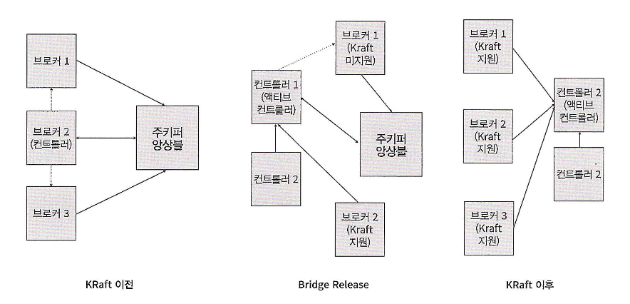

# [카프카 핵심 가이드] CHAPTER 6. 카프카 내부 메커니즘

> 이 글은 [카프카 핵심 가이드](https://product.kyobobook.co.kr/detail/S000201464167)책을 읽고 정리한 글입니다.

카프카의 내부 동작 방식을 이해하면 트러블슈팅을 하거나 카프카가 실행되는 방식을 이해하는데 도움이 된다.

아래 네 가지의 주제들을 깊이 이해한다면, 나중에 카프카를 튜닝할 때 도움이 될 것이다.

- 카프카 컨트롤러
- 카프카에서 복제가 작동하는 방식
- 카프카가 프로듀서와 컨슈머의 요청을 처리하는 방식
- 카프카가 저장을 처리하는 방식(파일 형식, 인덱스 등)

## 카프카 컨트롤러

카프카는 현재 클러스터의 멤버인 브로커들의 목록을 유지하기 위해 `아파치 주키퍼`를 사용한다.

- 각 브로커는 자동으로 생성된 고유의 식별자를 가진다. (혹은 브로커 설정 파일에 정의되어 있다.)
    - 여기서 브로커 프로세스가 주키퍼에 Ephemeral 노드의 형태로 ID를 등록한다.
- 만약 동일한 ID를 가진 다른 브로커를 시작하면 에러가 발생한다.

이전 1장에서 설명했듯이 여러 브로커가 모여 하나의 `클러스터`를 구성하고,
해당 클러스터 내의 브로커 중 하나가 `컨트롤러` 역할을 맡아 다른 브로커들을 관리한다.

여기서 컨트롤러는 **파티션 리더를 선출하는 역할**도 한다.

즉, 컨트롤러는 브로커가 클러스터에 추가되거나 제거될 때 파티션과 레플리카 중에서 리더를 선출할 책임을 진다.

2019년부터 아파치 카프카 커뮤니티는 주키퍼 기반 컨트롤러에서 레프트(Raft) 기반 컨트롤러로 옮기는 프로젝트를 시작했다.

- `KRaft` 라 불리는 새로운 컨트롤러는 **아파치 카프카 3.3부터 정식으로 프로덕션 환경에서 사용 가능한 기능**이 되었다.
- 이에 따라 최신 버전의 카프카 클러스터는 전통적인 주키퍼 기반 컨트롤러와 KRaft 기반 컨트롤러 둘 중 하나와 함께 실행될 수 있다.

그렇다면 왜 카프카 커뮤니티는 컨트롤러를 교체하기로 했을까?

가장 큰 이유는 **주키퍼 기반 구조로는 카프카 클러스터가 감당할 수 있는 파티션 개수에 한계가 명확했기 때문**이다.

이러한 결정이 나오게 된 이유를 정리하면 다음과 같다.

- 메타데이터 불일치
    - 원인: 컨트롤러가 주키퍼에 메타데이터를 쓰는 작업은 **동기적**이지만, 브로커에게 메시지를 보내거나 주키퍼로부터 업데이트를 받는 과정은 **비동기적**으로 이루어진다.
    - 결과: 이러한 처리 방식의 차이로 인해 브로커, 컨트롤러, 주키퍼 간에 **메타데이터 불일치**가 발생할 수 있으며, 이를 잡아내기도 어렵다.

- 컨트롤러 재시작 시 성능 병목
    - 원인: 컨트롤러가 재시작될 때마다 주키퍼로부터 **모든** 브로커와 파티션 정보를 읽어온 뒤, 다시 **모든** 브로커에게 전송해야 한다.
    - 결과: 파티션과 브로커의 수가 증가할수록 **데이터 양이 많아져 재시작 속도가 느려지는 병목 현상**이 발생한다.

- 메타데이터 소유권 구조의 비효율성
    - **작업의 종류**에 따라 어떤 것은 컨트롤러가, 어떤 것은 브로커가, 나머지는 주키퍼가 직접 처리하는 등 내부 아키텍처가 복잡하다.

- 운영 복잡도 증가
    - 주키퍼 자체가 또 하나의 복잡한 분산 시스템이다.
    - 그래서 카프카를 운영하기 위해 카프카뿐만 아니라 주키퍼에 대한 지식까지 갖춰야 하므로, 개발자는 **두 개의 분산 시스템을 배우고 관리해야 하는 부담**이 있다.

이러한 주키퍼 기반의 구조적 한계를 극복하기 위해 카프카 커뮤니티는 `KRaft`(Kafka Raft)라는 새로운 아키텍처를 도입했다.

### KRaft(Kafka Raft)

`KRaft`의 핵심 아이디어는 **"메타데이터도 사용자의 데이터처럼 이벤트 로그(Log)로 관리하자"** 는 것이다.

- 마치 우리가 카프카 토픽에 이벤트를 쌓고 재생하듯, 클러스터의 상태 변경 내역을 로그로 기록하여 관리함으로써
- 외부 시스템인 주키퍼 없이도 자체적으로 메타데이터의 일관성을 유지할 수 있게 되었다.

이 과정에서 컨트롤러의 개념과 운영 방식도 크게 진화했다.

- 기존에는 컨트롤러가 단순히 브로커 중 하나가 맡는 '임시 역할'에 불과했고, 메타데이터를 다른 브로커들에게 일방적으로 밀어넣는(Push) 방식이었다.
- KRaft 도입 이후 컨트롤러는 **메타데이터를 전문적으로 관리하는 독립적인 프로세스**로서 동작한다.
- 이제 브로커들이 **필요한 정보를 능동적으로 가져오는(Pull) 방식으로 변경**되었으며, 컨트롤러들은 Raft 알고리즘을 통해 자체적으로 리더(`액티브 컨트롤러`)를 선출한다.
- 덕분에 컨트롤러 장애 시에도 이미 최신 데이터를 공유하고 있는 다른 노드가 즉시 리더가 될 수 있어, 복구 속도가 주키퍼 기반 컨트롤러보다 빨라졌다.

즉, 주키퍼가 제거된 KRaft 모드에서 `컨트롤러`는 더 이상 데이터를 저장하는 브로커의 부수적인 역할이 아니라,
**메타데이터 로그를 저장하고 클러스터의 합의(Consensus)를 담당하는 핵심 프로세스**로 정의된다.

- 여기서 카프카에서 말하는 '합의'란 ? -> 클러스터의 현재 상태(메타데이터)에 대해 모든 컨트롤러 노드가 똑같은 정보를 가지기로 약속하는 것을 말한다.
- 역할 -> 여러 대의 컨트롤러 서버(Quorum)가 존재하더라도, 누가 리더이고 시스템 상태가 어떤지에 대해 단 하나의 정답만을 유지하도록 조율한다.
- `KRaft`는 이 '단 하나의 정답'을 보장하는 알고리즘이며, `컨트롤러`는 이를 수행하여 시스템의 두뇌 역할을 하는 핵심 프로세스다.

(그림. KRaft 마이그레이션 및 아키텍처 변화)

위 그림과 같이 버전 3.4.0 시점에서는 '브리지 릴리스(Bridge Release)' 기능이 얼리 액세스로 탑재되었다.

- 이를 통해 기존 주키퍼 기반 클러스터(Pre-KRaft)와 새로운 KRaft 컨트롤러가 일시적으로 공존할 수 있게 되어,
- 서비스 중단 없이 단계적으로 아키텍처를 업그레이드할 수 있는 길이 열렸다.

(KRaft 모드 사용법에 대한 자세한 내용은 책을 참고하자!)

## 카프카에서 복제가 작동하는 방식

복제 -> 카프카 아키텍처의 핵심이다.

- 카프카를 다른 말로 '분산되고, 분할되고, 복제된 커밋 로그 서비스'라고 표현한다.

카프카에 저장되는 데이터는 `토픽`을 단위로 조직화된다.

- 각 토픽은 1개 이상의 `파티션`으로 분할되며,
- 각 파티션은 다시 다수의 `레플리카`를 가질 수 있다.
- 각각의 레플리카는 브로커에 저장되는데, 대게 하나의 브로커는 수백 ~ 수천 개의 레플리카를 저장한다.

여기서 파티션 수와 레플리카 수를 헷갈릴 수 있어서 추가로 설명하자면,

- 파티션 수는 데이터를 몇 개의 조각으로 쪼갤 것인가로써 성능과 병렬 처리의 목적이고,
- 레플리카 수는 각 조각을 몇 개 정도로 복사해서 저장할 것인지에 대한 안정성과 고가용성의 목적이 크다.

### 레플리카의 종류(두 가지)

리더 레플리카
- 각 파티션에는 리더 역할을 하는 레플리카가 하나씩 있다.
- 일관성을 보장하기 위해 **모든 쓰기 요청**을 처리한다. (클라이언트는 설정에 따라 리더나 팔로워로부터 읽을 수 있다.)
- 팔로워 레플리카들이 보낸 '읽기 요청'을 통해 각 팔로워가 어디까지 복제했는지(오프셋)를 확인하고, `ISR`(In-Sync Replica) 목록을 관리한다.

팔로워 레플리카
- 리더를 제외한 나머지 레플리카들을 말한다.
- 일반 컨슈머처럼 리더에게 지속적으로 읽기 요청(Fetch Request)을 보내 메시지를 가져옴으로써 최신 상태를 동기화한다.
- 만약 리더가 죽으면 팔로워 중 하나가 새로운 리더가 된다. 단, **ISR(인-싱크 레플리카)에 속한 팔로워만 리더가 될 수 있다.**
  - `ISR`(인-싱크 레플리카) 은 지속적으로 최신 메시지를 요청하고 있는 레플리카를 말한다.
  - 참고로, 팔로워가 리더에게 요청을 보내지 않거나 최신 메시지를 가져가지 못한 시간을 넘기면 ISR에서 추방된다. (`replica.lag.time.max.ms` -> 기본: 10초)
- 리더 레플리카로부터 복제하는 과정에서 다양한 원인으로 동기화가 깨질 수 있다.
  - **네트워크 혼잡**으로 인해 복제 속도가 느려지거나
  - 브로커가 크래시가 나는 바람에 브로커가 재시작되어 복제 작업이 다시 시작할 수 있게 될 때까지 해당 브로커에 저장되어 있는 모든 레플리카들의 복제 상태가 뒤쳐지는 사태가 있다.

선호 리더란 파티션이 처음 생성될 때 **원래 리더**로 지정되었던 레플리카를 말한다.
- 파티션 생성 시 리더는 모든 브로커에 균등하게 분산되므로, 선호 리더가 실제 리더를 맡아야 클러스터의 부하가 균형을 이룬다.
- 리더가 다른 브로커로 바뀌었더라도, 선호 리더가 다시 동기화되면 카프카가 자동으로 리더를 선호 리더로 되돌려준다.
  - 설정값: `auto.leader.rebalance.enable=true`

## 카프카가 저장을 처리하는 방식

카프카의 기본 저장 단위는 `파티션 레플리카`이다.

파티션은 서로 다른 브로커들 사이에 분리될 수 없으며, 심지어 같은 브로커의 서로 다른 디스크에 분할 저장되는 것도 불가능하다.

즉,**파티션 크기 = 특정 디스크의 마운트 지점에 사용 가능한 공간에 제한**을 받는다.

### 파티션 할당 (Partition Allocation)

사용자가 토픽을 생성하면 카프카는 파티션을 브로커들에게 할당해야 한다. 이때 목표는 다음과 같다.

- 부하 분산: 가능한 한 브로커 간에 레플리카를 고르게 분산시킨다.
- 가용성 보장: 각 파티션의 레플리카는 서로 다른 브로커에 배치한다. -> 레플리카 수를 늘리려면 그에 따른 브로커 수도 늘려야 한다.
  - (만약 렉 정보가 설정되어 있다면, 서로 다른 렉에 할당하여 렉 전체 장애에 대비한다.)

주의할 점은 파티션 할당할 때 **디스크 공간을 고려하지 않는다는 점**이다.

새 파티션을 저장할 디렉터리(`log.dirs`)를 결정하는 규칙은 단순하다.
-> **현재 파티션 개수가 가장 적은 디렉터리**에 새 파티션을 저장한다.
- 디스크의 남은 용량이나 현재 부하 상태는 고려하지 않는다.
- 따라서, 여러 디스크를 혼용해서 사용할 경우 파티션 개수는 같아도 특정 디스크만 용량이 가득 차는 불균형이 발생할 수 있으니 주의해야 한다.

### 파일 관리(Segment)

카프카는 영구적으로 데이터를 저장하지 않으며, 모든 컨슈머가 읽어갈 때까지 기다려주지도 않는다.

대신, `보존 기한(Retention Period)`을 통해 정책을 설정할 수 있다. (예를 들어, "이만큼 오래된 메시지는 지운다" 거나 "용량이 이만큼 차면 지운다"와 같은 의미이다.)

하지만 거대한 하나의 파일에서 삭제할 데이터를 찾아 지우는 것은 비효율적이다.

그래서 카프카는 파티션을 여러개의 `세그먼트(Segment)` 로 분할하여 저장한다.

- 세그먼트 생성: 기본적으로 데이터가 1GB가 되거나 1주일이 지나면 세그먼트를 닫고, 새로운 세그먼트를 생성한다.
- 액티브 세그먼트: 현재 쓰기가 일어나고 있는 세그먼트를 말한다.
  - 액티브 세그먼트는 보존 기한이 지나도 삭제되지 않는다. (세그먼트가 닫혀야 삭제가 가능하다는 점!)
- 삭제 방식: 카프카는 개별 메시지를 지우는 게 아니라, **보존 기한이 지난 세그먼트 파일 자체를 통째로 삭제하는 방식**으로 효율성을 높인다.

### 파일 형식

카프카의 강력한 성능 비결 중 하나는 **디스크 저장 형식과 네트워크 전송 형식이 동일하다**는 점이다.

- Zero-Copy: 브로커는 디스크에서 읽은 데이터를 애플리케이션 레벨에서 압축 해제하거나 재조립할 필요가 없다.
  - 형식이 같기 때문에 OS 커널의 기능을 이용해 **디스크의 데이터를 그대로 네트워크 소켓으로 전송**한다. 
  - 과정에서 CPU 사용량과 메모리 복사 비용이 줄어들어 성능이 최적화된다.
- 배치 전송: 프로듀서도 메시지를 배치 단위로 묶어서 보내고, 브로커도 배치 형식으로 저장하며, 컨슈머도 배치 형식으로 가져간다.
  - 여기서 배치 용량이 클수록 -> 압축 효율은 높아지고 네트워크 오버헤드는 줄어든다.

카프카 메시지는 크게 사용자 페이로드와 시스템 헤더로 나뉜다.
- 사용자 페이로드에는 키값과 밸류값, 헤더 모음(선택 사항)을 포함하고, 각각의 헤더에는 자체적인 키/밸류 순서쌍을 보장한다.
- 시스템 헤더에는 메시지의 크기, 오프셋 델타(위치 차이), 타임스탬프 델타 등 카프카 내부 관리를 위한 메타데이터를 포함하고, 오버헤드를 줄이기 위해 최소한의 정보만 담긴다.

### 인덱스 (Index)

카프카는 컨슈머가 임의의 오프셋부터 메시지를 빠르게 읽을 수 있도록 인덱스를 유지한다.
- 오프셋 인덱스: 오프셋과 실제 물리적인 파일 위치(바이트)를 매핑한다.
- 타임스탬프 인덱스: 타임스탬프와 메시지 오프셋을 매핑한다. (시간 기준으로 메시지를 검색할 때, 몇몇 장애 복구 상황에서 유용하게 사용된다.)

### 압착 (Compaction)

일반적인 삭제 정책 외에 압착 정책이 있다.

이는 주로 키(Key)의 현재 값이 중요한 경우에 사용된다. -> e.g. 고객의 주소 변경 중, 현재 주소만 알면 되는 경우

- 동작 원리는 토픽 내에서 **동일한 키를 가진 메시지 중 최신의 값만 남기고** 나머지는 삭제한다.
- 구조적으로는 클린 영역과 더티 영역이 존재한다.
  - 클린 영역: 이전에 압착이 완료되어 키별로 최신값만 하나씩 남은 영역
  - 더티 영역: 압착 이후에 새로 쓰여진 영역으로 중복된 키가 존재할 수 있다.

- 주로 애플리케이션의 상태를 저장하거나, 시스템 크래시 발생 후 복구 과정에서 **최신 상태를 복원하는 용도**로 사용된다.