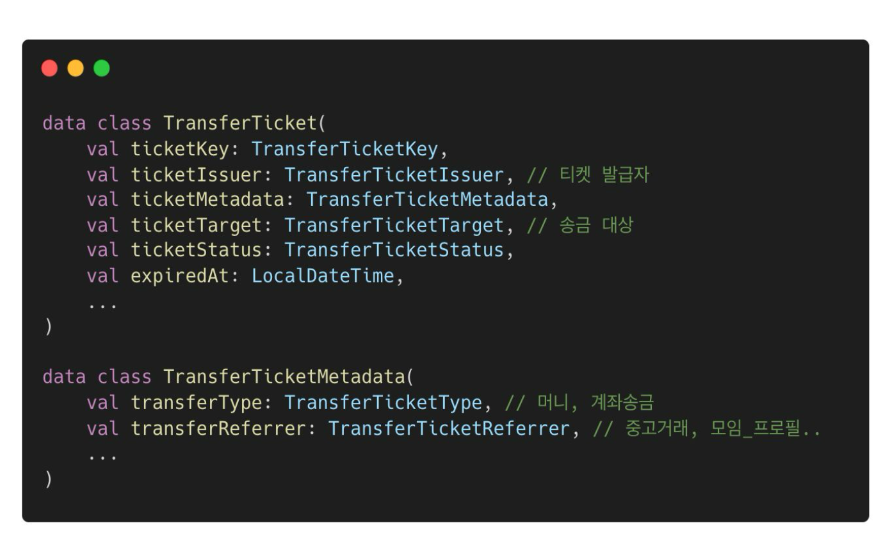
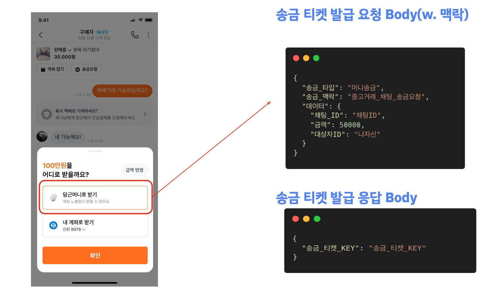

# 당근페이 송금의 플랫폼화: 중고거래 채팅 벗어나기 | 2025 당근 플랫폼 밋업 

> 이 글은 [당근페이 송금의 플랫폼화](https://www.youtube.com/watch?v=lBofNkykF74) 영상을 듣고 정리한 글입니다.
> 
> 영상 날짜: 2025. 11. 20

## 중고거래 채팅방 송금 알아보기

머니송금의 경우 중고거래할 때 당근페이의 송금하기 기능을 통해 상대방의 당근 지갑에 돈을 보낼 수 있다.

계좌송금의 경우 채팅방에 있는 계좌번호를 클릭하면 계좌송금 기능을 통해 상대방의 실명 계좌로 돈을 보낼 수 있다.

송금할 때 당근페이 유저 정보, 채팅방 정보, 중고거래 게시물 정보가 필요하다.
- 여기서 송금 서버는 채팅방 정보의 식별자만 알면 당근페이 유저 정보와 중고거래 게시물 정보를 파악할 수 있다.

여기서 중고거래 뿐만 아니라 다른 서비스에서도 송금을 할 수 있는 새로운 요구사항이 들어왔다.
- 목표는 모바일 앱 버전에 구애받지 않고 기능 확장이 가능해야 하고,
- 채팅방 종류에 따라 기능을 ON/OFF 할 수 있도록 해야 하는 것이었다.

이를 해결하기 위해서는 확장성 있는 API 설계가 필요했다.

이를 위해 머니 송금 API와 계좌 송금 API를 요청한 뒤 서버 내부 통신을 통해 채팅방 종류를 파악하도록 설계했다.

하지만 여기서 또 다른 문제가 생겼다.

### 문제 상황

첫 번째는 송금에 대한 세션이 부재한다는 점이다.
- 중고거래가 끝난 뒤에도 송금을 할 수 있다는 점에서 유효 기간 설정이 존재하지 않았고, 
- 송금을 요청하는 건수를 반복 요청했을 때 해당 요청건에 대한 데이터가 같아서 추적이 불가능하다는 점이었다.

두 번째는 채팅방에 대한 강결합 문제이다.
- 채팅방에 대한 정보가 없으면 송금을 할 수 없는 상황이었다.

이러한 두 가지 문제를 해결하고자 송금 티켓이라는 기능을 개발했다.

### 해결 방안: 송금 티켓

송금 티켓은 송금 맥락, 송금 대상, 송금 관련 정책 ->  세 가지로 관리하고 있다.

송금 티켓은 티켓 내의 특정 상황에서 송금이 일어날 수 있다는 것을 Enum 데이터로 관리하고 있다.

정의되지 않는 부분은 송금을 할 수 없도록 했다.

대략 아래와 같은 모습으로 구성했다.

전체 흐름은 크게 세 가지 과정으로 진행했다.
- 송금 티켓 발급 요청
- 송금 티켓 조회
- 송금 티켓 사용(송금) 

이렇게 함으로써 송금 요청을 할 때마다 송금티켓 값이 다르므로 데이터가 같아서 추적이 불가능하다는 점을 해결했고,
송금에 대한 유효 기간 설정도 추가함으로써 세션 부재에 대한 문제를 해결했다.

두 번째 문제였던 채팅방에 대한 강결합 문제는, 
티켓 발급 요청 시 채팅방 정보가 없더라도 송금 맥락 정보만으로 티켓을 발급받을 수 있도록 구조를 변경하여 해결했다. 

덕분에 채팅방 밖(예: 프로필, 모임)으로 송금 기능을 확장할 수 있었다.

## Review

송금과 관련된 비즈니스 문제를 해결하기 위해 확장성있는 API 설계를 왜, 어떻게 구성했고 개발했는지에 대해 알 수 있었다.

하지만, 영상을 다 보고 나서 드는 생각은 (이 영상에 한해서) 당근페이팀은 제품의 성장단계에 따라 기술적으로 문제를 해결하는 부분이 인상에 남았다.
