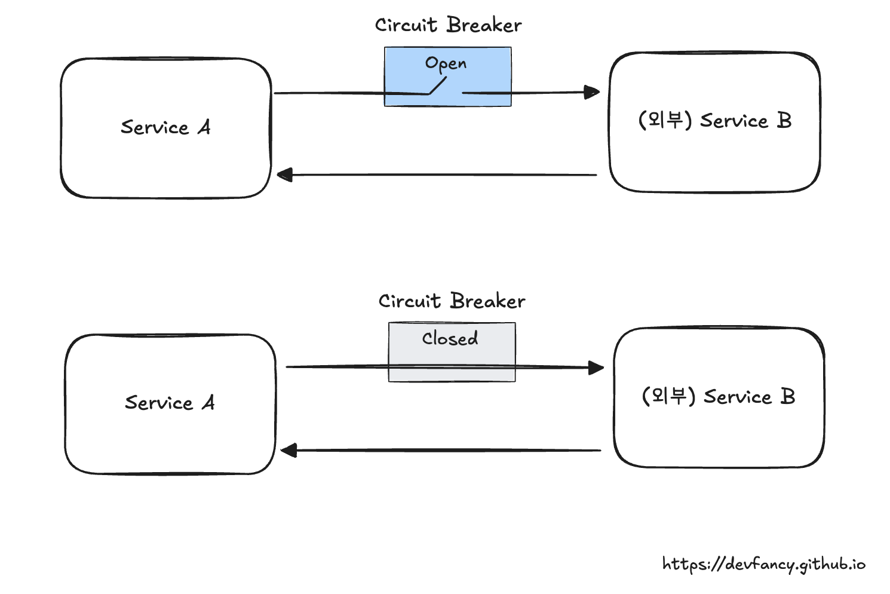
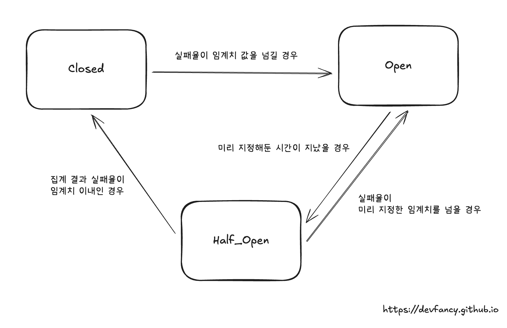

# Circuit Breaker

외부 API 연동 시 주의해야할 점 중 하나는 외부 시스템에 장애가 발생하는 경우입니다.

외부 시스템의 응답 지연이나 에러가 우리 시스템의 스레드 고갈로 이어지는 것을 방지하고,
장애 상황에 유연하게 대처하기 위해 서킷 브레이커(Circuit Breaker) 패턴을 사용합니다.

이번 글에서는 서킷 브레이커의 핵심 개념과 상태 변화, 그리고 Resilience4j를 활용한 구체적인 설정 방법을 정리해 봅니다.

## Concept

`CircuitBreaker`(서킷 브레이커)는 문제가 발생한 지점을 감지하여 실패하는 요청을 차단하고(Open),
이를 통해 시스템의 장애 확산을 막고 장애 복구를 도와주는 기능을 제공합니다.

서킷 브레이커를 지원하는 대표적인 라이브러리는 다음과 같습니다.
- Netflix Hystrix (deprecated)
  - MSA 환경에서 서킷 브레이커 패턴을 구현하여 장애 전파를 막고 장애를 감지하고 복구할 수 있는 내결함성을 갖는 오픈소스 라이브러리입니다. 
  - 현재는 개발이 중단되어 유지보수 모드이며, Resilience4j 사용을 권장하고 있습니다.
- Resilience4j
  - Java 8의 함수형 프로그래밍을 기반으로 설계된 경량화 라이브러리입니다.
  - CircuitBreaker 외에도 RateLimiter, Retry, TimeLimiter 등 다양한 코어 모듈을 제공합니다.

### Sliding Window

서킷 브레이커는 호출 결과를 저장하고 집계하기 위해 슬라이딩 윈도우 알고리즘을 사용합니다.

Resilience4j는 두 가지 타입을 제공합니다.
- Count-based sliding window (횟수 기반): 마지막 N번의 호출 결과를 집계합니다. (예시. 최근 100번의 요청 중 실패율 계산)
- Time-based sliding window (시간 기반): 마지막 N초 동안의 호출 결과를 집계합니다. (예시. 최근 10초 동안 들어온 요청들의 실패율 계산)

## Status

서킷 브레이커는 일반적으로 3가지 상태를 가지며, 이외에 특수 상태로 2가지를 가집니다.

- `Closed` (정상 상태)
  - 평소 정상적으로 요청을 처리하는 상태입니다.
  - 실패율이나 느린 응답률이 임계치를 넘으면 `Open` 상태로 전환되며, 서킷을 끊어버립니다.
- `Open` (장애/차단 상태)
  - 장애가 감지되어 외부 요청을 즉시 차단하는 상태입니다.
  - 요청 시 CallNotPermittedException 예외를 발생시키거나 Fallback 함수를 실행합니다.
  - 장애 판단 기준
    - Failure Rate: 실패 혹은 오류 응답의 비율.
    - Slow Call Rate: 설정한 시간보다 오래 걸린 요청의 비율.
- `Half_Open` (검증 상태)
  - `Open` 상태에서 일정 시간이 지난 후, 시스템이 복구되었는지 확인하기 위해 진입하는 상태입니다.
  - 제한된 횟수의 요청만 허용하여 성공 여부를 확인한 뒤, 다시 `Closed`나 `Open`으로 결정합니다.

특수 상태
- `Disabled`: 서킷 브레이커를 비활성화하여 항상 요청을 허용합니다.
- `Forced_Open`: 강제로 서킷을 열어 항상 요청을 거부합니다.

## Config property

Resilience4j의 `CircuitBreakerConfig`에서 사용하는 주요 설정값을 상태 전환 흐름에 따라 정리했습니다.

### Closed -> Open

실패율(Failure Rate) 또는 느린 호출율(Slow Call Rate)이 임계치를 초과할 때 전환됩니다.
- 단, **최소한의 호출 횟수**가 쌓여야 계산이 시작됩니다.

> 관련 설정값에 대해 설명과 기본값을 정리했습니다.

- `failureRateThreshold`
  - 실패율이 이 설정값(%) 이상이 되면 서킷이 Open 상태로 전환됩니다.
  - 기본값: 50

- `slowCallRateThreshold`
  - 느린 호출의 비율이 이 설정값(%) 이상이 되면 서킷이 Open 상태로 전환됩니다.
  - 기본값: 100

- `slowCallDurationThreshold`
  - 이 시간(ms)보다 오래 걸리는 호출을 느린 호출(Slow Call)로 간주합니다.
  - 기본값: 60000 [ms] (60초)

- `minimumNumberOfCalls`
  - 실패율이나 느린 호출율을 계산하기 위해 필요한 최소한의 호출 횟수입니다. 
  - 이 횟수만큼 데이터가 쌓이기 전에는 서킷이 절대 열리지 않습니다.
  - 기본값: 100

- `slidingWindowType`
  - 호출 결과를 집계하는 방식입니다. `COUNT_BASED`(최근 N회) 또는 `TIME_BASED`(최근 N초) 중 선택합니다.
  - 기본값: `COUNT_BASED`

- `slidingWindowSize`
  - 슬라이딩 윈도우의 크기입니다. `COUNT_BASED`라면 호출 횟수(N회), `TIME_BASED`라면 시간(N초)을 의미합니다.
  - 기본값: 100

### Open -> Half_Open

Open 상태에서 일정 시간이 지나면 Half_Open 상태로 전환을 시도합니다.

- `waitDurationInOpenState`
  - 설명: 서킷이 Open 상태로 진입한 후, Half_Open 상태로 전환되기 전까지 대기하는 시간(ms)입니다.
  - 기본값: 60000 [ms] (60초)

- `automaticTransitionFromOpenToHalfOpenEnabled`
  - `true`로 설정 시, 대기 시간이 지나면 별도의 모니터링 스레드가 자동으로 상태를 Half_Open으로 변경합니다.
  - `false`일 경우, 대기 시간이 지난 후 **첫 번째 요청이 들어와야** 상태가 변경됩니다.
  - 기본값: false

### Half_Open (상태 유지 및 검증)

서킷이 열려있던 상태에서, 서비스가 복구되었는지 확인하기 위해 **제한된 횟수의 요청**만 허용합니다.

- `permittedNumberOfCallsInHalfOpenState`
  - Half_Open 상태일 때 허용되는 요청의 횟수입니다. 
  - 이 횟수만큼의 호출 결과를 바탕으로 서킷을 다시 닫을지(Closed) 열지(Open) 결정합니다.
  - 기본값: 10

- `maxWaitDurationInHalfOpenState`
  - Half_Open 상태에서 머무를 수 있는 최대 시간입니다. 
  - 0일 경우: 허용된 횟수(permittedNumberOfCalls)가 다 찰 때까지 무한정 기다립니다.
  - 0보다 큰 경우: 해당 시간이 지나면 강제로 Open 상태로 전환됩니다.
  - 기본값: 0

### Half_Open -> Closed

Half_Open 상태에서의 집계 결과가 정상 범위(임계치 미만)일 경우 전환됩니다.

- 별도의 전용 프로퍼티 없이, 앞서 설정한 `failureRateThreshold`와 `slowCallRateThreshold`를 기준으로 판단합니다.
- `permittedNumberOfCallsInHalfOpenState` 만큼의 요청을 수행한 후, **실패율이 임계치보다 낮으면** Closed 상태로 돌아갑니다.

### Half_Open -> Open

Half_Open 상태에서의 집계 결과가 여전히 비정상(임계치 이상)일 경우 전환됩니다.
- 마찬가지로 `failureRateThreshold`와 `slowCallRateThreshold`를 기준으로 판단합니다.
- **실패율이 임계치보다 같거나 높으면** 다시 Open 상태로 돌아가며, 다시 `waitDurationInOpenState` 만큼 대기해야 합니다.

### Exception Handling Config

모든 예외가 서킷을 열어야 하는 장애는 아닙니다. 

비즈니스 로직상의 예외는 무시하고, 네트워크 에러만 실패로 기록하고 싶을 때 사용합니다.

- `recordExceptions`
  - 실패로 기록할 예외 클래스들을 지정합니다.
  - 여기에 지정된 예외(및 그 하위 클래스)가 발생하면 **실패 카운트**가 증가합니다.
  - 참고: 목록을 명시하면, 여기에 포함되지 않은 다른 예외들은 성공으로 간주됩니다.
  - 기본값: empty (기본적으로 모든 예외를 실패로 간주하지만, 명시하면 해당 예외만 실패로 봅니다.)
- `ignoreExceptions`
  - 실패나 성공 어느 쪽으로도 기록하지 않고 무시할 예외 클래스들을 지정합니다.
  - 비즈니스 로직 에러(예: UserNotFoundException) 처리에 유용합니다.
  - 기본값: empty
- 우선순위 주의사항
  - ignoreExceptions가 recordExceptions보다 우선순위가 높습니다.
  - 즉, 어떤 예외가 두 설정 목록에 모두 포함되어 있다면, 해당 예외는 **무시**됩니다.
- `recordFailurePredicate`
  - 예외 객체를 인자로 받아 **실패 여부**(true/false)를 반환하는 커스텀 함수를 설정합니다.
  - 복잡한 예외 판별 로직이 필요할 때 사용합니다.
  - 기본값: throwable -> true (모든 예외를 실패로 간주)
- `ignoreExceptionPredicate`
  - 예외 객체를 인자로 받아 **무시 여부**(true/false)를 반환하는 커스텀 함수를 설정합니다.
  - 기본값: throwable -> false (무시하지 않음)

실무에서는 recordExceptions에 IOException, TimeoutException과 같은 명확한 인프라/네트워크 장애만 등록하고, 나머지 예외는 성공으로 처리되도록 하는 방식을 선호합니다.

이렇게 하면 코드 버그로 인해 서킷이 열려 정상적인 서버가 차단되는 상황을 방지할 수 있습니다.

## Reference

- [[공식문서] CircuitBreaker](https://resilience4j.readme.io/docs/circuitbreaker)
- [[공식문서] Spring Cloud Circuit Breaker](https://spring.io/projects/spring-cloud-circuitbreaker#overview)
- [[우아한형제들] 개발자 의식의 흐름대로 적용해보는 서킷브레이커](https://techblog.woowahan.com/15694/) - 2024.01.11
- [[당근테크] 서킷브레이커 사용 방식 개선하기 | 당근 SERVER 밋업 2회](https://www.youtube.com/watch?v=ThLfHtoEe1I) - 2023.11.23
- [[올리브영] Circuitbreaker를 사용한 장애 전파 방지](https://oliveyoung.tech/2023-08-31/circuitbreaker-inventory-squad/) - 2023.08.31
- [[개인 블로그] Spring - CircuitBreaker](https://backtony.tistory.com/83)
